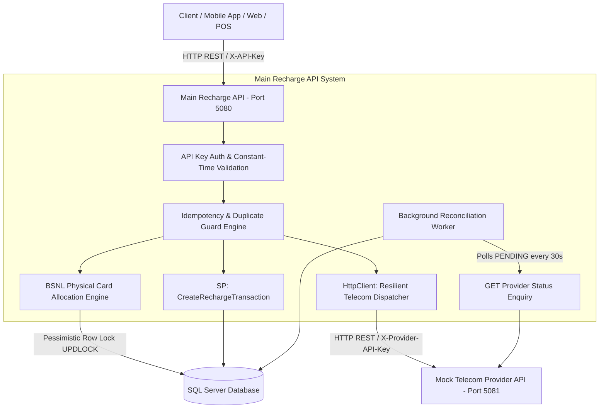
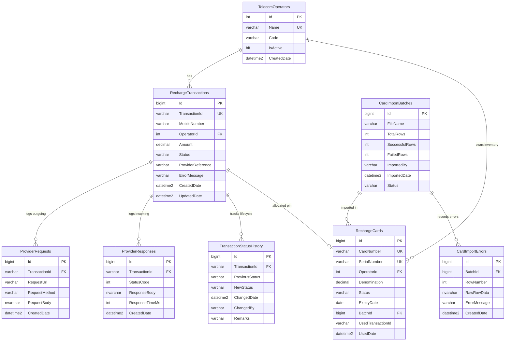
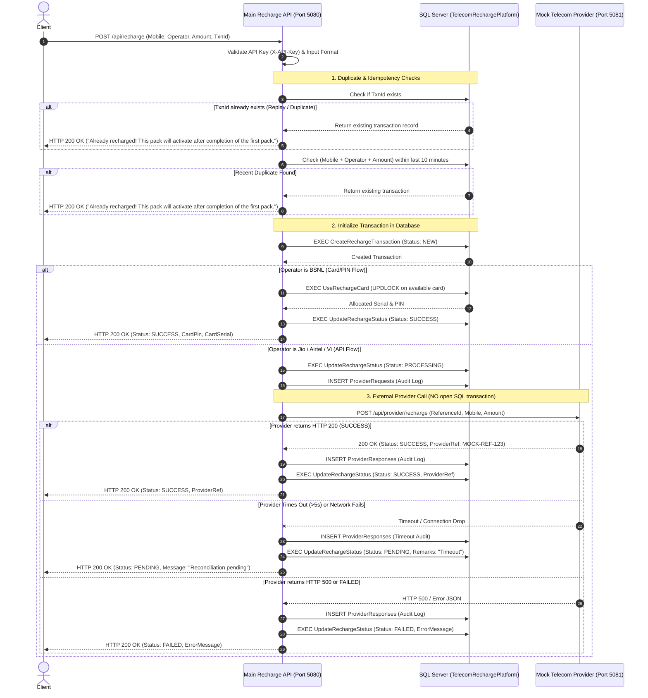
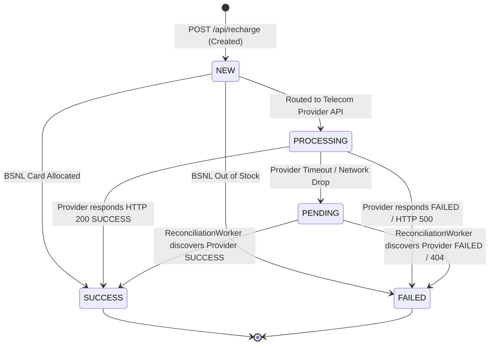

# Telecom Recharge Platform

A high-performance, resilient, and production-ready backend system for processing mobile recharges across Indian telecom operators (**Jio**, **Airtel**, **Vi**, **BSNL**). Built with **ASP.NET Core (.NET 9)**, **Entity Framework Core**, and **Microsoft SQL Server 2019+**.

---

## 1. Required Deliverables Matrix

| Deliverable | Location / Artifact | Status |
|---|---|---|
| **Complete Visual Studio Solution** | [`TelecomRechargePlatform.sln`](TelecomRechargePlatform.sln) | ✅ Complete |
| **Complete C# Source Code** | [`src/MainRechargeApi/`](src/MainRechargeApi/) & [`src/MockTelecomApi/`](src/MockTelecomApi/) | ✅ Complete |
| **SQL Server Database Scripts** | [`database/`](database/) | ✅ Complete |
| ├── Table Creation & Index Scripts | [`database/01_schema.sql`](database/01_schema.sql) | ✅ Complete |
| ├── Master Operator Seed Data | [`database/02_seed.sql`](database/02_seed.sql) | ✅ Complete |
| ├── Stored Procedures (ACID & Concurrency Safe) | [`database/03_stored_procedures.sql`](database/03_stored_procedures.sql) | ✅ Complete |
| └── Audit, Analytics & Duplicate Queries | [`database/04_queries.sql`](database/04_queries.sql) | ✅ Complete |
| **Main Recharge API** | [`src/MainRechargeApi`](src/MainRechargeApi) (Port `5080`) | ✅ Complete |
| **Mock Telecom Provider API** | [`src/MockTelecomApi`](src/MockTelecomApi) (Port `5081`) | ✅ Complete |
| **Postman Collection & Testing Guide** | [`TelecomRechargePlatform.postman_collection.json`](TelecomRechargePlatform.postman_collection.json) & [`POSTMAN_TESTING.md`](POSTMAN_TESTING.md) | ✅ Complete |
| **Architecture & Deployment Manual** | [`README.md`](README.md) | ✅ Complete |

---

## 2. Architecture

### 2.1 System Architecture Overview

The system is architected around the **Stateless Web API + Resilient Background Worker + Decoupled Optimistic State Engine** pattern.



### 2.2 Core Components

1. **Main Recharge API (`src/MainRechargeApi` - Port 5080)**:
   - Exposes RESTful endpoints for initiating recharges (`POST /api/recharge`) and querying transaction status (`GET /api/recharge/status/{transactionId}`).
   - Executes multi-layered validation (10-digit numeric mobile validation, supported active operators, positive amount bounds).
   - Enforces transaction-level idempotency and 10-minute duplicate guard filters.
   - Routes API-based recharges (Jio, Airtel, Vi) to the telecom provider and inventory-based recharges (BSNL) to the secure PIN allocation engine.
2. **Mock Telecom Provider API (`src/MockTelecomApi` - Port 5081)**:
   - Simulates realistic telecom operator behavior:
     - **₹199 / standard amounts**: Immediate `SUCCESS` with generated provider reference (`MOCK-REF-...`).
     - **₹299**: Simulates network timeout (8-second delay triggering client timeout) for testing asynchronous recovery.
     - **₹500**: Simulates operator-level failure (`HTTP 500` / `FAILED`).
   - Supports status polling (`GET /api/provider/recharge/status/{referenceId}`) for reconciliation.
3. **Background Reconciliation Worker (`ReconciliationWorker.cs`)**:
   - Inherits from `BackgroundService` (`IHostedService`).
   - Periodically queries the database for transactions in `PENDING` state (e.g. caused by network drops or provider timeouts).
   - Queries the provider status endpoint, resolves transaction final states (`SUCCESS` or `FAILED`), and updates database audit logs.
4. **Microsoft SQL Server Database (`TelecomRechargePlatform`)**:
   - Stores transactions, provider request/response audit trails, full status lifecycle histories, operator configurations, and card inventory.
   - Enforces ACID guarantees through stored procedures utilizing fine-grained locking (`UPDLOCK`, `ROWLOCK`).

---

## 3. Database Design

### 3.1 Entity-Relationship Diagram (ERD)



### 3.2 Tables and Schema Design

| Table Name | Purpose | Key Constraints & Indexes |
|---|---|---|
| `TelecomOperators` | Master catalogue of supported operators (Jio, Airtel, Vi, BSNL). | `PK_TelecomOperators` (Clustered), `UQ_TelecomOperators_Name` |
| `RechargeTransactions` | Core ledger of all mobile recharge attempts. | `PK_RechargeTransactions`, `UQ_RechargeTransactions_TxnId`, `CHK_Status IN ('NEW','PROCESSING','SUCCESS','FAILED','PENDING')`, `CHK_Amount > 0`, `IX_DuplicateCheck` |
| `ProviderRequests` | Outgoing HTTP API audit log (URL, method, payload). | `PK_ProviderRequests`, `FK_ProviderRequests_Transaction`, `IX_TransactionId` |
| `ProviderResponses` | Incoming HTTP response audit log (status code, latency, body). | `PK_ProviderResponses`, `FK_ProviderResponses_Transaction`, `IX_TransactionId` |
| `TransactionStatusHistory`| Immutable lifecycle audit trail (`NEW` → `PROCESSING` → `SUCCESS`/`PENDING`/`FAILED`). | `PK_TransactionStatusHistory`, `FK_History_Transaction`, `IX_TransactionId` |
| `RechargeCards` | Inventory of pre-loaded scratch cards/PINs for BSNL. | `PK_RechargeCards`, `UQ_CardNumber`, `UQ_SerialNumber`, `CHK_Status IN ('AVAILABLE','RESERVED','USED','EXPIRED','BLOCKED')`, `IX_RechargeCards_Search` |
| `CardImportBatches` | Batch header tracking bulk CSV/Excel card imports. | `PK_CardImportBatches`, `CHK_Status IN ('PROCESSING','COMPLETED','FAILED')` |
| `CardImportErrors` | Line-by-line validation errors during card import. | `PK_CardImportErrors`, `FK_CardImportErrors_Batch` |
| `MockProviderTransactions`| State table simulating external telecom provider database. | `PK_MockProviderTransactions`, `UQ_MockProviderTransactions_RefId` |

### 3.3 Optimized Indexing Strategy

- **Duplicate Detection Composite Index**: `IX_RechargeTransactions_DuplicateCheck (MobileNumber, OperatorId, Amount, CreatedDate)` optimizes the 10-minute duplicate guard query to sub-millisecond execution.
- **Card Allocation Search Index**: `IX_RechargeCards_Search (OperatorId, Denomination, Status) INCLUDE (CardNumber, SerialNumber, ExpiryDate)` enables instant lookups for available BSNL PINs without table scans.
- **Status Filtering & Reconciliation Index**: `IX_RechargeTransactions_Status (Status) INCLUDE (TransactionId, MobileNumber, Amount, CreatedDate)` allows the background reconciliation worker to scan `PENDING` rows efficiently.

### 3.4 Stored Procedures (12 ACID Procedures)

1. `dbo.CreateRechargeTransaction`: Atomically creates the recharge record and initial status history in `NEW` state.
2. `dbo.UpdateRechargeStatus`: Concurrency-safe status update using `UPDLOCK, ROWLOCK` to prevent race conditions during state transitions.
3. `dbo.GetTransactionByTransactionId`: Queries transaction details by unique Transaction ID.
4. `dbo.GetTransactionByProviderReference`: Resolves transaction by external provider reference.
5. `dbo.GetTransactionsByStatus`: Batch query for transactions matching a specific status.
6. `dbo.GetTransactionsByDateRange`: Filtered reporting query supporting date boundaries and status filters.
7. `dbo.GetRechargeAmountByOperator`: Aggregated financial reporting per operator.
8. `dbo.GetDuplicateMobileRecharges`: Audit procedure detecting multiple recharges to the same mobile/operator/amount on the same calendar day.
9. `dbo.UseRechargeCard`: Atomically locks (`UPDLOCK`) and marks an available card PIN as `USED` to guarantee no double-allocation under high concurrency.
10. `dbo.GetTransactionStatusHistory`: Retrieves the complete audit history of status changes for a transaction.
11. `dbo.GetCardImportBatchDetails`: Retrieves batch header metadata and all row validation errors.
12. `dbo.GetCardInventorySummary`: Aggregates active voucher inventory counts grouped by operator and denomination.

---

## 4. Recharge Transaction Flow

### 4.1 End-to-End Sequence Flow



### 4.2 Status Lifecycle State Machine



---

## 5. Duplicate Prevention

The platform implements a **three-tier duplicate protection engine** ensuring zero double-charges and preventing repeated calls to telecom providers:

```
┌─────────────────────────────────────────────────────────────────────────────┐
│                       DUPLICATE PREVENTION LAYERS                           │
├─────────────────────────────────────────────────────────────────────────────┤
│ Layer 1: Client Transaction ID Idempotency Check                            │
│ └─ Detects replayed requests with identical Client TransactionId.           │
│    Directly returns existing transaction state without provider call.       │
├─────────────────────────────────────────────────────────────────────────────┤
│ Layer 2: 10-Minute Time-Window Duplicate Guard                              │
│ └─ Detects identical (Mobile + Operator + Amount) within last 10 minutes.   │
│    Protects end-users from accidental double clicks or app retries.         │
├─────────────────────────────────────────────────────────────────────────────┤
│ Layer 3: Database Unique Constraint Enforcer                                │
│ └─ UQ_RechargeTransactions_TxnId catches race conditions at SQL level.      │
│    Catches concurrent threads and safely falls back to primary record.      │
└─────────────────────────────────────────────────────────────────────────────┘
```

1. **Transaction ID Idempotency**:
   - If a client supplies a `TransactionId` that already exists in the database, the API intercepts the request, avoids calling the telecom provider, and returns `HTTP 200 OK` with the exact message:
     ```json
     {
       "transactionId": "TXN-20260830-SAMPLE01",
       "mobileNumber": "9876543210",
       "operatorName": "Jio",
       "amount": 199.00,
       "status": "SUCCESS",
       "providerReference": "MOCK-REF-...",
       "message": "Already recharged! This pack will activate after completion of the first pack."
     }
     ```
2. **10-Minute Time-Window Guard**:
   - If a client initiates a new recharge for the same `MobileNumber` + `Operator` + `Amount` within 10 minutes of a previously `SUCCESS` or `PENDING` recharge, the duplicate guard activates and returns the existing transaction.
3. **Database-Level Unique Key Guard**:
   - `UQ_RechargeTransactions_TxnId` enforces physical uniqueness. In high-concurrency race conditions where two identical transactions pass initial read checks simultaneously, the database unique key violation is caught gracefully and returns the primary record.

---

## 6. Timeout Handling

Telecom operators frequently suffer from network jitter, gateway latency spikes, or temporary downstream outages. Tying customer requests to hanging network sockets degrades user experience.

1. **HttpClient Timeout Configuration**:
   - Outgoing HTTP client `ProviderApi` is configured with a strict timeout (5 seconds).
2. **Graceful Timeout Interception**:
   - When the provider takes longer than the timeout window, .NET throws `TaskCanceledException`.
   - The platform catches the timeout gracefully, logs the event, and records a timeout audit record in `ProviderResponses`.
3. **Transition to `PENDING` State**:
   - **Crucial Rule**: The transaction is **NEVER** marked as `FAILED` on a timeout, because the provider might have actually processed the recharge and debited the balance.
   - The status is set to `PENDING`, and `HTTP 200 OK` is returned to the client informing them that the transaction is under verification.
4. **Asynchronous Resolution**:
   - The background `ReconciliationWorker` picks up the `PENDING` transaction and verifies its status with the provider automatically.

---

## 7. Provider Reconciliation

Transactions in `PENDING` state are automatically resolved by the built-in **`ReconciliationWorker`** background service.

```mermaid
graph LR
    A[ReconciliationWorker] -->|1. Query every 30s| B[(Find PENDING Transactions)]
    B -->|2. For each transaction| C[GET /api/provider/recharge/status/{TxnId}]
    C -->|Provider confirms SUCCESS| D[Update DB: SUCCESS + ProviderRef]
    C -->|Provider confirms FAILED| E[Update DB: FAILED + ErrorMessage]
    C -->|Provider returns 404| F[Update DB: FAILED - Not Found]
    C -->|Provider still processing| G[Keep PENDING for next cycle]
```

1. **Scheduled Polling**:
   - The worker runs every 30 seconds (configurable via `Reconciliation:IntervalSeconds` in `appsettings.json`).
2. **Provider Status Enquiry**:
   - For each pending transaction, the worker queries the provider's status enquiry endpoint: `GET /api/provider/recharge/status/{transactionId}`.
3. **State Resolution**:
   - If the provider reports `SUCCESS`, the transaction is transitioned to `SUCCESS` with the confirmed `ProviderReference`.
   - If the provider reports `FAILED` or `404 Not Found`, the transaction is transitioned to `FAILED` with the appropriate error explanation.
   - Every status change creates a new record in `TransactionStatusHistory` with `ChangedBy: "SYSTEM"` and detailed remarks.

---

## 8. Error Handling

The application adheres to structured, RFC-compliant error reporting with consistent payload models (`ApiErrorResponse`).

```json
{
  "statusCode": 400,
  "errorCode": "INVALID_MOBILE_NUMBER",
  "errorMessage": "Mobile number must be exactly 10 digits numeric (e.g. 9876543210).",
  "timestamp": "2026-08-30T16:35:00Z"
}
```

### Standard Error Handling Matrix

| Scenario | HTTP Status | Error Code | Description / Action |
|---|---|---|---|
| Null / Empty Request Body | `400 Bad Request` | `INVALID_REQUEST` | Rejects empty JSON payloads. |
| Invalid Mobile Number | `400 Bad Request` | `INVALID_MOBILE_NUMBER` | Rejects mobile numbers that are not exactly 10 digits numeric. |
| Unsupported Operator | `400 Bad Request` | `UNSUPPORTED_OPERATOR` | Validates against active operators in `TelecomOperators`. |
| Invalid Amount | `400 Bad Request` | `INVALID_AMOUNT` | Amount must be positive and not exceed ₹50,000. |
| Missing / Invalid API Key | `401 Unauthorized` | `UNAUTHORIZED` | Rejects requests missing `X-API-Key` or with invalid tokens. |
| Transaction Not Found | `404 Not Found` | `TRANSACTION_NOT_FOUND` | Returned when querying a non-existent Transaction ID. |
| Duplicate ID Collision | `409 Conflict` / `200 OK` | `DUPLICATE_TRANSACTION` | Caught and resolved idempotently. |
| Provider HTTP 500 | `200 OK` (Processed) | Status: `FAILED` | Gracefully captures provider crash without failing the API gateway. |
| Unhandled Exceptions | `500 Internal Error` | `INTERNAL_SERVER_ERROR` | Global exception middleware masks internal stack traces from clients. |

---

## 9. Authentication & Security

### 9.1 API Key Authentication

All incoming requests are authenticated using custom HTTP header keys:

| Component | Header Name | Configuration Setting | Default Test Key |
|---|---|---|---|
| **Main Recharge API** | `X-API-Key` | `Authentication:ApiKey` | `mobile2000-secret-api-key-2026` |
| **Mock Telecom Provider** | `X-Provider-API-Key` | `Authentication:ApiKey` | `telecom-provider-test-key-2026` |

### 9.2 Constant-Time Comparison (Timing Attack Protection)

To prevent side-channel timing attacks, all API key comparisons use constant-time byte comparisons via .NET `CryptographicOperations.FixedTimeEquals`:

```csharp
byte[] expectedKeyBytes = Encoding.UTF8.GetBytes(configuredApiKey);
byte[] actualKeyBytes = Encoding.UTF8.GetBytes(extractedApiKey);

if (!CryptographicOperations.FixedTimeEquals(expectedKeyBytes, actualKeyBytes))
{
    return UnauthorizedResponse(context, "Invalid API Key provided.");
}
```

### 9.3 Sensitive Data Sanitization

- API keys, auth headers, and secrets are strictly excluded from console logs, structured logs, and database audit tables.
- Stack traces and raw internal SQL errors are sanitized before returning responses to clients.

---

## 10. Logging

Structured logging is implemented using ASP.NET Core `ILogger` with tagged operational events for rapid observability and Logstash/Elasticsearch/Splunk indexing:

| Log Tag | Event Description |
|---|---|
| `[INCOMING_REQUEST]` | Logs incoming payload (Mobile, Operator, Amount, ClientTxnId). |
| `[VALIDATION_ERROR]` | Logs input validation failures (invalid mobile, unsupported operator). |
| `[TRANSACTION_ID]` | Logs generated or client-supplied unique transaction identifiers. |
| `[PROVIDER_REQUEST]` | Logs outgoing HTTP request parameters to the telecom provider (sanitized). |
| `[PROVIDER_RESPONSE]` | Logs HTTP status code, latency (ms), and response body from provider. |
| `[TIMEOUT]` | Logs provider request timeouts and duration. |
| `[STATUS_CHANGE]` | Logs transaction lifecycle transitions (`NEW` → `PROCESSING` → `SUCCESS`/`PENDING`/`FAILED`). |
| `[STATUS_ENQUIRY]` | Logs transaction lookup events. |
| `[RECONCILIATION]` | Logs background reconciliation worker actions and updates. |
| `[EXCEPTION]` | Logs unhandled exceptions with full stack traces in backend logs only. |

---

## 11. Why SQL Transactions Are NOT Kept Open During Provider API Calls

### 💡 Architectural Deep-Dive

In enterprise payment and telecom recharge architectures, **a database transaction must NEVER be held open while waiting for an external HTTP API response**.

Here is why our platform uses an **Optimistic State Machine with Asynchronous Reconciliation (Saga Pattern)** instead of an open SQL transaction:

```
❌ WRONG ANTI-PATTERN: Open SQL Transaction during External I/O
Client ──> [BEGIN TRAN] ──> [INSERT NEW] ──> [WAIT HTTP API (2-10s)] ──> [COMMIT / ROLLBACK]
                                                  ▲
                                                  │ Database connection blocked!
                                                  │ Row / Page locks held!
                                                  │ Connection pool starved!

─────────────────────────────────────────────────────────────────────────────────────────────────

✅ CORRECT PATTERN (IMPLEMENTED): Discrete Atomic Steps + Decoupled I/O
Step 1: [BEGIN TRAN] ──> [INSERT NEW] ───────────────> [COMMIT TRAN] (Releases DB Connection <1ms)
Step 2: [HTTP API CALL] (Asynchronous Network I/O - No DB locks held)
Step 3: [BEGIN TRAN] ──> [UPDATE SUCCESS / PENDING] ──> [COMMIT TRAN] (Releases DB Connection <1ms)
Step 4: If timeout occurs: Background Reconciliation resolves state asynchronously.
```

### Critical Reasons:

1. **Database Connection Pool Starvation**:
   - ADO.NET connection pools have a finite number of connections (default 100).
   - If an external telecom provider takes 3 to 10 seconds to respond, 100 concurrent recharge requests will consume **100% of the database connection pool**.
   - All other requests (even lightweight status checks or unrelated queries) will hang and fail with `TimeoutException: Connection pool exhausted`.
2. **Pessimistic Locking & Table Contention**:
   - Holding an open SQL transaction places exclusive locks (`X` locks) or update locks (`U` locks) on index pages and table rows.
   - Any concurrent query attempting to read or update related rows is blocked, causing severe cascade locking and database deadlocks.
3. **Unpredictable External Latency & Network Jitter**:
   - External telecom carrier APIs are distributed over the public internet and subject to latency spikes, TCP connection drops, and gateway restarts.
   - Tying relational database ACID transaction boundaries to external third-party network reliability violates clean architectural separation of concerns.
4. **Thread Pool Exhaustion**:
   - Threads waiting on open database transactions across slow external I/O starve the web server's .NET thread pool, leading to degraded throughput and complete server unresponsiveness.
5. **Distributed Transaction Impossibility (2PC Anti-Pattern)**:
   - External REST APIs do not participate in Two-Phase Commit (2PC / WS-AtomicTransaction). If the database transaction aborts due to a local SQL error after the telecom provider has already processed the recharge, the customer gets recharges for free without a database record.
   - By creating the record in `NEW`/`PROCESSING` state first, the system guarantees an immutable audit trail even if the network fails.

---

## 12. How to Run Locally

Follow these instructions to set up and run the complete platform on your local machine.

### 12.1 Prerequisites
- **.NET 9.0 SDK**: [Download .NET 9.0](https://dotnet.microsoft.com/download/dotnet/9.0) (Verify with `dotnet --version`).
- **Microsoft SQL Server**: SQL Server 2019/2022, SQL Server Express, or LocalDB.
- **SQL Server Management Studio (SSMS)** or `sqlcmd` command line utility.
- **Postman**: (Optional) For executing automated API test suites.

### 12.2 Database Setup

1. Open SSMS or `sqlcmd` and connect to your SQL Server instance (e.g. `localhost` or `.\SQLEXPRESS`).
2. Create the database:
   ```sql
   CREATE DATABASE TelecomRechargePlatform;
   GO
   ```
3. Run the database scripts in the exact specified order:
   - **Step 1**: Execute [`database/01_schema.sql`](database/01_schema.sql) (Creates all tables, constraints, check conditions, and non-clustered indexes).
   - **Step 2**: Execute [`database/02_seed.sql`](database/02_seed.sql) (Seeds master telecom operators: Jio, Airtel, Vi, BSNL).
   - **Step 3**: Execute [`database/03_stored_procedures.sql`](database/03_stored_procedures.sql) (Deploys all 10 ACID stored procedures).

   *Via `sqlcmd` command line*:
   ```bash
   sqlcmd -S . -C -d TelecomRechargePlatform -i database/01_schema.sql
   sqlcmd -S . -C -d TelecomRechargePlatform -i database/02_seed.sql
   sqlcmd -S . -C -d TelecomRechargePlatform -i database/03_stored_procedures.sql
   ```

### 12.3 Configure Connection Strings

Check [`src/MainRechargeApi/appsettings.json`](src/MainRechargeApi/appsettings.json) and ensure the connection string points to your SQL Server instance:

```json
{
  "ConnectionStrings": {
    "DefaultConnection": "Server=localhost;Database=TelecomRechargePlatform;Trusted_Connection=True;TrustServerCertificate=True;MultipleActiveResultSets=true"
  },
  "MockTelecomApi": {
    "BaseUrl": "http://localhost:5081"
  },
  "Authentication": {
    "ApiKey": "mobile2000-secret-api-key-2026"
  }
}
```

### 12.4 Launching the Services

Open two terminal windows:

```bash
# Terminal 1 — Start the Mock Telecom Provider API (Port 5081)
cd "mobile2000 Telecom Backend"
dotnet run --project src/MockTelecomApi

# Terminal 2 — Start the Main Recharge API (Port 5080)
cd "mobile2000 Telecom Backend"
dotnet run --project src/MainRechargeApi
```

### 12.5 Interactive Swagger Documentation
- **Main Recharge API Swagger**: [http://localhost:5080/swagger](http://localhost:5080/swagger)
- **Mock Telecom Provider Swagger**: [http://localhost:5081/swagger](http://localhost:5081/swagger)

*(Click **Authorize** in Swagger and enter `mobile2000-secret-api-key-2026` to test authenticated endpoints).*

---

## 13. How to Deploy to IIS (Internet Information Services)

Follow this production guide to deploy both APIs on Windows Server IIS.

### Step 1: Enable IIS Features
Open PowerShell as Administrator and run:
```powershell
Enable-WindowsOptionalFeature -Online -FeatureName `
  IIS-WebServerRole, IIS-WebServer, IIS-CommonHttpFeatures, `
  IIS-HttpErrors, IIS-HttpRedirect, IIS-ApplicationDevelopment, `
  IIS-NetFx4Extended-ASPNET45, IIS-ISAPIExtensions, IIS-ISAPIFilter, `
  IIS-RequestFiltering, IIS-StaticContent
```

### Step 2: Install the .NET 9 Hosting Bundle
1. Download and run the [.NET 9 Hosting Bundle Installer](https://dotnet.microsoft.com/download/dotnet/9.0) (installs .NET Runtime and `AspNetCoreModuleV2`).
2. Restart IIS:
   ```powershell
   net stop was /y
   net start w3svc
   ```

### Step 3: Publish Applications in Release Mode
```powershell
# Create deployment directories
New-Item -ItemType Directory -Force -Path C:\inetpub\wwwroot\MainRechargeApi
New-Item -ItemType Directory -Force -Path C:\inetpub\wwwroot\MockTelecomApi

# Publish Main API
dotnet publish src/MainRechargeApi/MainRechargeApi.csproj -c Release -o C:\inetpub\wwwroot\MainRechargeApi

# Publish Mock Provider API
dotnet publish src/MockTelecomApi/MockTelecomApi.csproj -c Release -o C:\inetpub\wwwroot\MockTelecomApi
```

### Step 4: Configure IIS Application Pools
1. Open **IIS Manager** (`inetmgr`).
2. Create two Application Pools:
   - **`MainRechargeApiPool`**: .NET CLR Version: **No Managed Code**, Pipeline Mode: **Integrated**.
   - **`MockTelecomApiPool`**: .NET CLR Version: **No Managed Code**, Pipeline Mode: **Integrated**.
3. In **Advanced Settings** for both pools:
   - **Start Mode**: Set to `AlwaysRunning` *(Ensures the background `ReconciliationWorker` keeps running continuously without sleeping on idle)*.
   - **Idle Time-out (minutes)**: Set to `0`.
   - **Identity**: Set to `ApplicationPoolIdentity` or your dedicated domain service account.

### Step 5: Create Websites in IIS
1. **Main Recharge API Site**:
   - Site Name: `MainRechargeApi`
   - Application Pool: `MainRechargeApiPool`
   - Physical Path: `C:\inetpub\wwwroot\MainRechargeApi`
   - Binding: Port `5080` (or `443` HTTPS in production).
2. **Mock Telecom Provider Site**:
   - Site Name: `MockTelecomApi`
   - Application Pool: `MockTelecomApiPool`
   - Physical Path: `C:\inetpub\wwwroot\MockTelecomApi`
   - Binding: Port `5081`.

### Step 6: Set NTFS Directory Permissions
Grant the IIS Application Pool identities read and execute permissions:
```powershell
icacls "C:\inetpub\wwwroot\MainRechargeApi" /grant "IIS AppPool\MainRechargeApiPool":(OI)(CI)RX
icacls "C:\inetpub\wwwroot\MockTelecomApi" /grant "IIS AppPool\MockTelecomApiPool":(OI)(CI)RX
```

### Step 7: Grant SQL Server Database Permissions
In SQL Server Management Studio, execute:
```sql
USE master;
CREATE LOGIN [IIS AppPool\MainRechargeApiPool] FROM WINDOWS;
GO

USE TelecomRechargePlatform;
CREATE USER [IIS AppPool\MainRechargeApiPool] FOR LOGIN [IIS AppPool\MainRechargeApiPool];
ALTER ROLE db_datareader ADD MEMBER [IIS AppPool\MainRechargeApiPool];
ALTER ROLE db_datawriter ADD MEMBER [IIS AppPool\MainRechargeApiPool];
GRANT EXECUTE ON SCHEMA::dbo TO [IIS AppPool\MainRechargeApiPool];
GO
```

---

## 14. Postman API Testing Guide

An importable Postman collection is provided in [`TelecomRechargePlatform.postman_collection.json`](TelecomRechargePlatform.postman_collection.json). Detailed walkthroughs for each test scenario are documented in [`POSTMAN_TESTING.md`](POSTMAN_TESTING.md).

### Quick Testing Summary

| Test Case | Method | URL / Payload | Expected Result |
|---|---|---|---|
| **1. Successful Jio Recharge** | `POST /api/recharge` | `{ "mobileNumber": "9876543210", "operatorName": "Jio", "amount": 199 }` | `200 OK` → `Status: "SUCCESS"`, `ProviderReference: "MOCK-REF-..."` |
| **2. Duplicate Prevention** | `POST /api/recharge` | Identical payload sent twice within 10 minutes | `200 OK` → Returns existing transaction without calling provider: `"Already recharged!..."` |
| **3. Airtel Timeout & Auto-Reconciliation** | `POST /api/recharge` | `{ "mobileNumber": "9811122233", "operatorName": "Airtel", "amount": 299 }` | Immediate `200 OK` with `Status: "PENDING"`. After 30s background reconciliation, status automatically becomes `SUCCESS`. |
| **4. Vi Operator Error Simulation** | `POST /api/recharge` | `{ "mobileNumber": "9822233344", "operatorName": "Vi", "amount": 500 }` | `200 OK` → `Status: "FAILED"`, `ErrorMessage: "Provider internal error"` |
| **5. BSNL Scratch Card Allocation** | `POST /api/recharge` | `{ "mobileNumber": "9412345678", "operatorName": "BSNL", "amount": 100 }` | `200 OK` → `Status: "SUCCESS"`, Returns `CardPin` and `CardSerialNumber`. |
| **6. Invalid Mobile Validation** | `POST /api/recharge` | `{ "mobileNumber": "123", "operatorName": "Jio", "amount": 199 }` | `400 Bad Request` → `INVALID_MOBILE_NUMBER` |
| **7. Missing / Bad Authentication** | `POST /api/recharge` | Header `X-API-Key: invalid` | `401 Unauthorized` |
| **8. Status Enquiry** | `GET /api/recharge/status/{txnId}` | Query status by transaction ID | `200 OK` → Returns current status, operator, amount, provider reference. |
| **9. CSV Voucher Import** | `POST /api/cards/import/raw` | Raw CSV text payload / multipart file | `200 OK` → Returns `batchId`, `successfulRows`, `failedRows`, and error logs. |
| **10. Voucher Stock Summary** | `GET /api/cards/inventory` | Query inventory stock | `200 OK` → Aggregates voucher cards by operator, denomination, status. |

---

## 15. CSV Card / Voucher Import (Feature 18)

The platform supports bulk importing prepaid recharge / voucher card inventory from CSV files with full ACID transaction safety, multi-tier validation, and row-level error reporting.

### 15.1 CSV Format Specification

The CSV file must contain a header row with the following column structure:

```csv
CardNumber,SerialNumber,Operator,Denomination,ExpiryDate
987654321001,SER10001,Airtel,100,2027-12-31
987654321002,SER10002,Jio,199,2027-12-31
987654321003,SER10003,Vi,249,2027-12-31
987654321004,SER10004,BSNL,50,2027-12-31
987654321005,SER10005,BSNL,100,2027-12-31
```

### 15.2 Field Validation Rules

| Column | Validation Criteria | Error Handled |
|---|---|---|
| `CardNumber` | Required, 6-50 alphanumeric characters. Must be unique in file and database. | Duplicate card detection, empty field rejection. |
| `SerialNumber` | Required, 3-50 characters. Must be unique in file and database. | Duplicate serial detection, empty field rejection. |
| `Operator` | Must match an active operator in `TelecomOperators` (Jio, Airtel, Vi, BSNL). | Rejects unknown or inactive operators. |
| `Denomination` | Must be a valid positive decimal number (`> 0`). | Rejects non-numeric or negative values. |
| `ExpiryDate` | Must be a valid ISO date (`YYYY-MM-DD`) and cannot be in the past. | Rejects expired vouchers and malformed dates. |

### 15.3 Transaction Safety & Fault Tolerance

```
[CSV Stream] ──> [Streaming RFC-4180 Parser]
                         │
                         ▼
             [Row-by-Row Validator Engine]
             ├── Valid Rows  ──> [RechargeCards (Status: AVAILABLE)]
             └── Invalid Rows ──> [CardImportErrors (RowNumber, RawData, ErrorMessage)]
                         │
                         ▼
        [BEGIN TRANSACTION (ACID Execution)]
        ├── 1. Insert Batch Header in `CardImportBatches` (Status: PROCESSING)
        ├── 2. Bulk Insert Valid Cards in `RechargeCards` (Linked to BatchId)
        ├── 3. Bulk Insert Error Logs in `CardImportErrors` (Linked to BatchId)
        ├── 4. Update Batch Header (Status: COMPLETED / PARTIAL_SUCCESS / FAILED)
        [COMMIT TRANSACTION]
```

- **Atomic Commits**: All valid cards and error logs for a batch are saved within a single database transaction.
- **Partial Success Tolerance**: If 5 out of 100 rows have validation errors, the 95 valid cards are safely committed to available inventory, while the 5 invalid rows are recorded in `CardImportErrors` for administrative review.
- **Duplicate Prevention**: Detects duplicates both within the uploaded file itself and against existing records in SQL Server.

### 15.4 Voucher Import API Endpoints

- `POST /api/cards/import`: Uploads a `.csv` file via multipart/form-data.
- `POST /api/cards/import/raw`: Imports raw CSV string directly in a JSON payload.
- `GET /api/cards/batches`: Lists past import batches with pagination (`page`, `pageSize`).
- `GET /api/cards/batches/{batchId}`: Retrieves batch header and individual row error details.
- `GET /api/cards/inventory`: Aggregates active card stock by operator and denomination.

# Mobile_2000_Telecom_backend_dot.not
