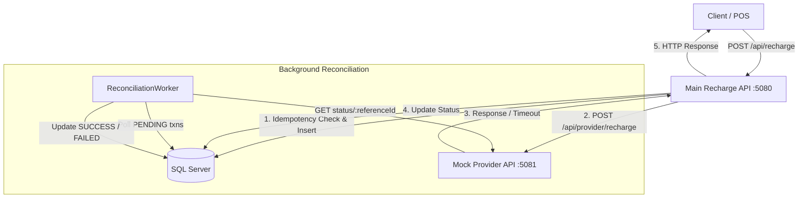
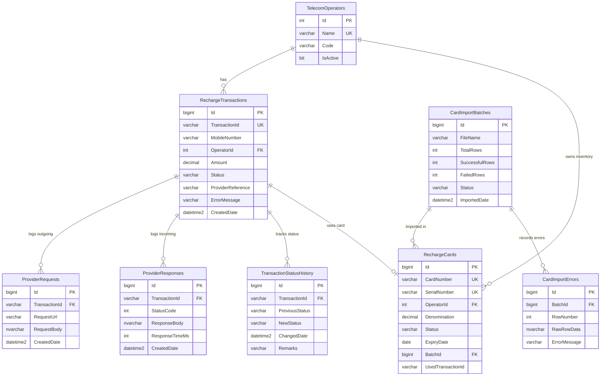

# Mobile 2000 Telecom Recharge Platform in India

## Overview

A backend recharge processing platform built with ASP.NET Core Web API and SQL Server. It handles mobile recharge transactions across multiple operators (Jio, Airtel, Vi, BSNL), provides duplicate protection and timeout reconciliation, and supports bulk CSV card/voucher inventory imports.

## Tech Stack

- **Framework:** .NET 9 (C#)
- **Web API:** ASP.NET Core Web API (REST / JSON)
- **Database:** Microsoft SQL Server
- **Data Access:** Entity Framework Core + ADO.NET (Stored Procedures)
- **Documentation & Testing:** Swagger / OpenAPI, Postman

## Architecture



## Project Structure

```
mobile2000 Telecom Backend/
├── TelecomRechargePlatform.sln
├── README.md
├── POSTMAN_TESTING.md
├── TelecomRechargePlatform.postman_collection.json
├── database/
│   ├── 01_schema.sql
│   ├── 02_seed.sql
│   ├── 03_stored_procedures.sql
│   └── 04_queries.sql
└── src/
    ├── MainRechargeApi/
    │   ├── Program.cs
    │   ├── appsettings.json
    │   ├── Controllers/
    │   │   ├── RechargeController.cs
    │   │   └── CardImportController.cs
    │   ├── Data/
    │   │   └── RechargeDbContext.cs
    │   ├── DTOs/
    │   ├── Middleware/
    │   │   ├── ApiKeyAuthMiddleware.cs
    │   │   └── GlobalExceptionHandlerMiddleware.cs
    │   ├── Models/
    │   └── Services/
    │       ├── CardImportService.cs
    │       └── ReconciliationWorker.cs
    └── MockTelecomApi/
        ├── Program.cs
        ├── appsettings.json
        ├── Controllers/
        │   └── ProviderRechargeController.cs
        ├── Data/
        │   └── MockDbContext.cs
        └── Models/
```

## Database

The database uses stored procedures for critical state transitions and pessimistic locking (`UPDLOCK, ROWLOCK`) on card inventory allocations.

### Core Tables

- **TelecomOperators:** Master list of operators (Jio, Airtel, Vi, BSNL).
- **RechargeTransactions:** Records every recharge attempt with amount, status, and provider references.
- **ProviderRequests:** Outbound HTTP request audit log.
- **ProviderResponses:** Inbound HTTP response and timeout audit log.
- **TransactionStatusHistory:** Audit trail tracking all transaction status changes.
- **RechargeCards:** Prepaid voucher/PIN inventory.
- **CardImportBatches:** Batch summary records for CSV imports.
- **CardImportErrors:** Row-level validation error logs from imports.

### Entity Relationship Diagram



## Recharge Flow

1. **Authenticate & Validate:** Request is checked for a valid `X-API-Key` header and valid request parameters (10-digit mobile number, positive amount, active operator).
2. **Duplicate Check:** Checks if `TransactionId` already exists or if the same mobile + operator + amount was submitted within the last 10 minutes. If found, returns the existing record without calling the provider.
3. **Initialize Record:** Creates a `RechargeTransactions` row with status `NEW` via stored procedure `CreateRechargeTransaction` and commits the SQL transaction.
4. **Route by Operator:**
   - **BSNL (Card Flow):** Allocates an available card using `UseRechargeCard` stored procedure (atomic `UPDLOCK`), marks transaction `SUCCESS`, and returns the PIN and Serial Number.
   - **Jio / Airtel / Vi (API Flow):** Updates status to `PROCESSING`, logs outbound request to `ProviderRequests`, and sends an HTTP POST request to the provider API.
5. **Handle Provider Response:**
   - **Success (200):** Updates transaction status to `SUCCESS` and stores provider reference.
   - **Failure / 500:** Updates transaction status to `FAILED` with error details.
   - **Timeout / Network Error:** Updates transaction status to `PENDING` for background reconciliation.
6. **Return Response:** Returns the standardized `RechargeResponse` to the client.

## Duplicate Protection

The platform implements multi-tier duplicate protection:

1. **Application-Level Idempotency Check:** Existing `TransactionId` queries return the prior transaction result immediately.
2. **10-Minute Sliding Window:** Identical requests (same mobile, operator, and amount within 10 minutes) return the existing transaction.
3. **Database Unique Constraint:** `RechargeTransactions.TransactionId` has a `UNIQUE NONCLUSTERED INDEX`. Under concurrent race conditions where two requests pass application checks at the same millisecond, the second database `INSERT` fails on the unique constraint, preventing double-processing.

## Timeout Handling

When an external provider call times out or drops connection:

1. The Main API catches the `HttpRequestException` or `TaskCanceledException`.
2. The transaction status is updated to `PENDING` and logged in `ProviderResponses`.
3. The client receives an immediate `200 OK` response with status `PENDING`.
4. `ReconciliationWorker` (a background service running every 30 seconds) queries all `PENDING` transactions and calls `GET /api/provider/recharge/status/{transactionId}` on the provider.
5. When the provider confirms the transaction outcome, the background worker updates the database record to `SUCCESS` or `FAILED`.

## CSV Card Import

The import pipeline supports bulk uploading voucher cards via multipart file or raw CSV payload:

1. **File Validation:** Checks that the file is not empty and header columns match expected names (`CardNumber, SerialNumber, Operator, Denomination, ExpiryDate`).
2. **Streaming Parse & Row Validation:** Validates operator name, positive denomination, future expiry date, and required character lengths.
3. **Duplicate Detection:** Checks for duplicates within the uploaded batch using an in-memory `HashSet` and against existing cards in the database.
4. **Chunked Bulk Insert:** Inserts valid records into `RechargeCards` in batches of 2,000 within a single transaction.
5. **Partial Success:** Valid rows are imported while invalid rows are logged to `CardImportErrors` with exact row numbers and error reasons.
6. **Import Summary:** Returns `CardImportResponse` containing `batchId`, `totalRows`, `successfulRows`, `failedRows`, `duplicates`, and error list.

## API Endpoints

### Main Recharge API (`http://localhost:5080`)

| Method | Endpoint | Purpose |
|---|---|---|
| `POST` | `/api/recharge` | Process a mobile recharge |
| `GET` | `/api/recharge/status/{transactionId}` | Query transaction status by Transaction ID |
| `GET` | `/api/recharge/history/{transactionId}` | Get audit history of status changes for a transaction |
| `POST` | `/api/cards/import` | Upload CSV card file (multipart/form-data) |
| `POST` | `/api/cards/import/raw` | Import CSV from raw text string in JSON body |
| `GET` | `/api/cards/batches` | List past import batches with pagination |
| `GET` | `/api/cards/batches/{batchId}` | Get batch details and row validation errors |
| `GET` | `/api/cards/inventory` | Get summary of available card inventory |

### Mock Telecom Provider API (`http://localhost:5081`)

| Method | Endpoint | Purpose |
|---|---|---|
| `POST` | `/api/provider/recharge` | Simulate provider recharge processing |
| `GET` | `/api/provider/recharge/status/{referenceId}` | Query simulated transaction status |
| `GET` | `/api/provider/recharge/rules` | List amount-based simulation rules |

## Authentication

Authentication uses an API Key header:

- **Main Recharge API:** Requires `X-API-Key` header (configured in `appsettings.json` under `Authentication:ApiKey`).
- **Mock Telecom Provider API:** Requires `X-Provider-API-Key` header (configured in `appsettings.json` under `Authentication:ApiKey`).
- **Validation:** Implemented via custom `ApiKeyAuthMiddleware` using `CryptographicOperations.FixedTimeEquals` for constant-time comparison to prevent timing attacks.
- Swagger UI includes an API Key security definition for testing authenticated endpoints directly in the browser.

## Logging

Structured logging is implemented across all components using `Microsoft.Extensions.Logging`:

- Incoming requests with mobile numbers, operator, and amount.
- Outbound provider request payloads and URLs.
- Inbound provider response codes, execution times, and bodies.
- Timeouts, connectivity failures, and simulated errors.
- Status transitions and background reconciliation polls.
- CSV import batch progress, row-level validation errors, and completion summaries.
- Sensitive credentials and API keys are excluded from log outputs.

## How to Run Locally

### Prerequisites

- .NET 9.0 SDK
- Microsoft SQL Server (LocalDB, Express, or full SQL Server instance)

### 1. Database Setup

Open SQL Server Management Studio (SSMS) or SQLCMD and run the scripts in order:

```sql
-- 1. Create database and tables
database/01_schema.sql

-- 2. Seed operators (Jio, Airtel, Vi, BSNL)
database/02_seed.sql

-- 3. Create stored procedures
database/03_stored_procedures.sql
```

### 2. Configure Connection Strings

Update `ConnectionStrings:DefaultConnection` in both `appsettings.json` files if your SQL Server instance name differs from `Server=localhost;Database=TelecomRechargePlatform;Trusted_Connection=True;TrustServerCertificate=True;`.

- `src/MainRechargeApi/appsettings.json`
- `src/MockTelecomApi/appsettings.json`

### 3. Start Mock Provider API

```powershell
cd "src/MockTelecomApi"
dotnet run --urls "http://localhost:5081"
```

### 4. Start Main Recharge API

Open a separate terminal:

```powershell
cd "src/MainRechargeApi"
dotnet run --urls "http://localhost:5080"
```

### 5. Access Swagger UI

- Main Recharge API: `http://localhost:5080/swagger`
- Mock Telecom Provider API: `http://localhost:5081/swagger`

## Postman Testing

A complete Postman collection is included in the root directory: `TelecomRechargePlatform.postman_collection.json`. Detailed step-by-step testing instructions are available in `POSTMAN_TESTING.md`.

### Tested Scenarios

1. **Successful Jio / Airtel / Vi Recharge:** Verifies standard successful recharge with provider response.
2. **Duplicate Prevention:** Verifies identical request within 10 minutes returns cached result without re-calling provider.
3. **Airtel Timeout & Auto-Reconciliation:** Verifies amount 299 causes timeout, status becomes `PENDING`, and background worker reconciles to `SUCCESS`.
4. **Provider Error Simulation:** Verifies amount 500 triggers provider failure and transaction is marked `FAILED`.
5. **BSNL Voucher Allocation:** Verifies card inventory allocation and PIN return.
6. **Input Validation:** Verifies invalid mobile numbers, missing operators, and invalid amounts return 400 Bad Request.
7. **Authentication:** Verifies missing or invalid `X-API-Key` returns 401 Unauthorized.
8. **Status Enquiry:** Queries transaction status and history.
9. **CSV Card Import:** Imports cards via multipart CSV and raw payload, verifying duplicate detection and error reporting.
10. **Card Concurrency:** Validates atomic `UPDLOCK` prevents double allocation of the same card.

## IIS Deployment

1. **Install Hosting Bundle:** Install the ASP.NET Core .NET 9 Hosting Bundle on the IIS server.
2. **Publish Applications:**
   ```powershell
   dotnet publish src/MainRechargeApi/MainRechargeApi.csproj -c Release -o publish/MainRechargeApi
   dotnet publish src/MockTelecomApi/MockTelecomApi.csproj -c Release -o publish/MockTelecomApi
   ```
3. **Configure Application Pools:**
   - Create two Application Pools in IIS (`MainRechargeApiPool`, `MockTelecomApiPool`).
   - Set **.NET CLR Version** to `No Managed Code`.
4. **Create IIS Sites / Applications:**
   - Bind `MainRechargeApi` to port 5080 (or desired port).
   - Bind `MockTelecomApi` to port 5081.
5. **Set Permissions:** Grant `IIS_IUSRS` read/execute access to published folders.
6. **Environment Variables:** Set production connection strings and provider URLs in `web.config` or IIS Configuration Editor if needed.

## Design Notes

- **Separation of DB Transactions from External HTTP Calls:** Database transactions are committed before sending HTTP requests to the external provider. This avoids holding database locks open during remote network latency and eliminates connection pool exhaustion.
- **Asynchronous Eventual Consistency:** Timeouts move transactions to `PENDING` rather than retrying immediately, preventing double-recharge risks. The `ReconciliationWorker` resolves final states safely via provider status queries.
- **Pessimistic Concurrency for Voucher Inventory:** The `UseRechargeCard` stored procedure utilizes `WITH (UPDLOCK, ROWLOCK)` to ensure only one thread can allocate any given card record at a time.
- **REST / JSON Protocol:** RESTful JSON endpoints are used across both APIs for simplicity, performance, and standard tooling compatibility.
